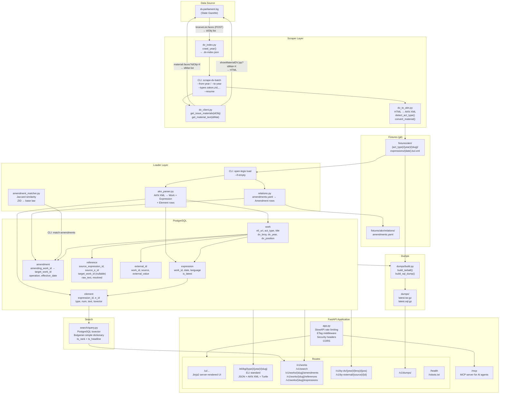
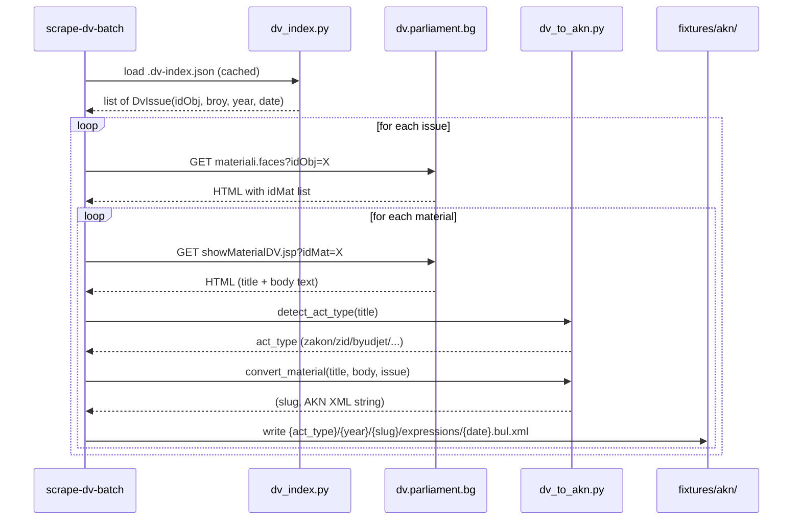
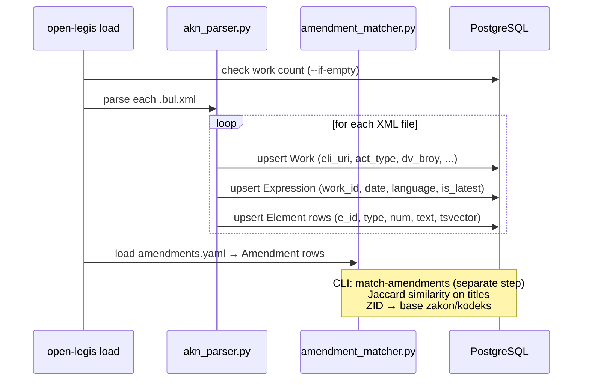
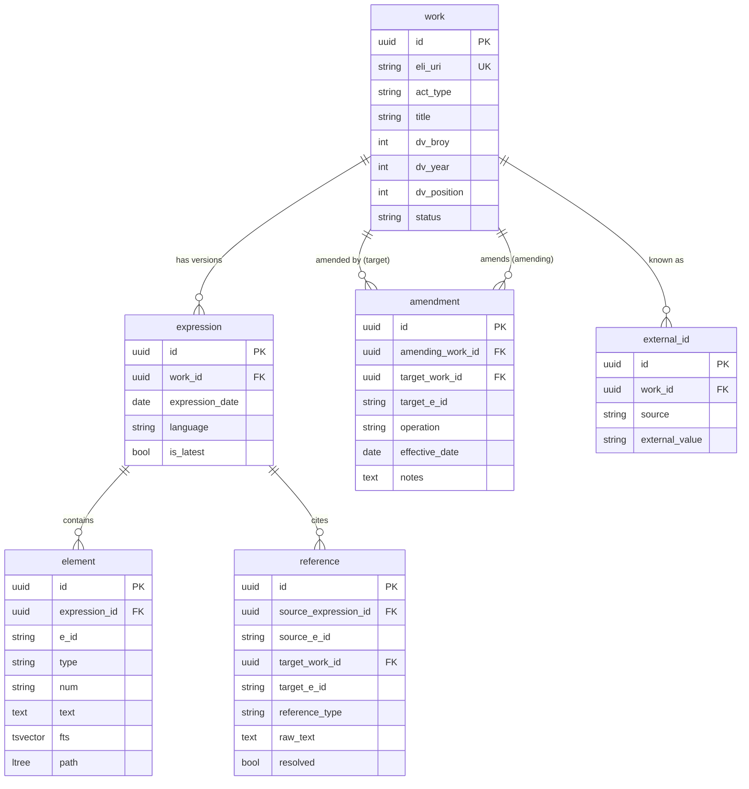

# open-legis Architecture

## System Overview



## Data Flow: Scraping



## Data Flow: Loading into DB



## AKN XML Structure (Akoma Ntoso 3.0)

```
fixtures/akn/zakon/2024/za-foo/
└── expressions/
    └── 2024-12-15.bul.xml
        └── <akomaNtoso>
              <act name="zakon">
                <meta>
                  <identification>
                    <FRBRwork> <FRBRuri>/eli/bg/zakon/2024/za-foo</FRBRuri>
                  <body>
                    <chapter eId="chp_1">
                      <section eId="sec_1">
                        <article eId="art_1">
                          <paragraph eId="art_1__para_1">
                          <point eId="art_1__para_1__pt_1">
                    <hcontainer name="final-provisions" eId="sec_final">
                      <hcontainer name="paragraph" eId="sec_final__para_1">  ← § items
```

## Database Schema



## API Route Map

| Method | Path | Auth | Rate limit | Description |
|--------|------|------|-----------|-------------|
| GET | `/ui/` | — | — | Homepage (server-rendered) |
| GET | `/ui/works/{uri}` | — | — | Work detail page |
| GET | `/eli/bg/{type}/{year}/{slug}` | — | 300/min | Work (JSON / AKN XML / Turtle) |
| GET | `/eli/bg/{type}/{year}/{slug}/{date}/{lang}` | — | 300/min | Expression |
| GET | `/eli/bg/{type}/{year}/{slug}/{date}/{lang}/{eId}` | — | 300/min | Element |
| GET | `/v1/works` | — | 120/min | List all works (paginated) |
| GET | `/v1/search` | — | 60/min | Full-text search |
| GET | `/v1/works/{slug}/amendments` | — | — | Amendment graph |
| GET | `/v1/works/{slug}/references` | — | — | Citation graph |
| GET | `/v1/works/{slug}/expressions` | — | — | Version history |
| GET | `/v1/by-dv/{year}/{broy}/{pos}` | — | — | DV reference → 301 ELI redirect |
| GET | `/v1/by-external/{source}/{id}` | — | — | External ID → 301 ELI redirect |
| GET | `/v1/dumps/` | — | — | List available dumps |
| GET | `/v1/dumps/{name}` | — | 10/day | Download dump file |
| GET | `/health` | — | — | Health check |
| GET | `/robots.txt` | — | — | Robots policy |
| * | `/mcp` | — | — | MCP server (AI agents) |

## ELI URI Scheme

```
/eli/bg/{act_type}/{year}/{slug}                         ← Work
/eli/bg/{act_type}/{year}/{slug}/{date}/{lang}           ← Expression
/eli/bg/{act_type}/{year}/{slug}/{date}/{lang}/{eId}     ← Element

Example:
/eli/bg/zakon/2024/za-darzhavnia-byudzhet
/eli/bg/zakon/2024/za-darzhavnia-byudzhet/2024-12-15/bul
/eli/bg/zakon/2024/za-darzhavnia-byudzhet/2024-12-15/bul/art_42
```
